#### Сессии и Cookies

* `Cookies` посылаются браузером при каждом запросе и если сессия с id находится, это означает что пользователь
  аутентифицирован.
* `Из сессии` мы получаем данные об этом пользователе (объект Authentication). Эти данные кладутся в потом текущего
  пользователя (ThreadLocal) и доступны только в этом потоке.

  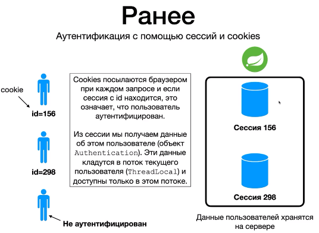
--------------------------------------

#### Проблема использования подхода: Сессии и Cookies

* В большинстве случаев аутентификация с помощью Сессий и Cookies предпочтительный вариант.
* Но иногда требуется другой подход, когда ? `Микро-сервисная архитектура!`
* Микро-сервисная архитектура отличается от Монолитной архитектуры когда у нас есть большое количество небольших
  Сервисов которые берут на себя какую-то работу. И когда мы переходим на Микро-сервисную архитектуру мы сталкиваемся с
  данной проблемой Сессий и Cookies.
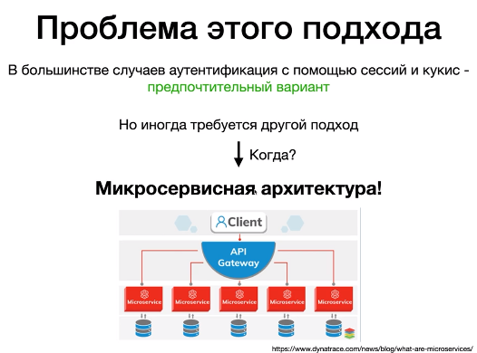
--------------------------------------
Давайте посмотрим в чем проблема данного подхода Сессии и Cookies и при этом будем использовать Микро-сервисную
архитектуру. Получается у нас 3 сессии для 1 пользователя, что не есть хорошо.
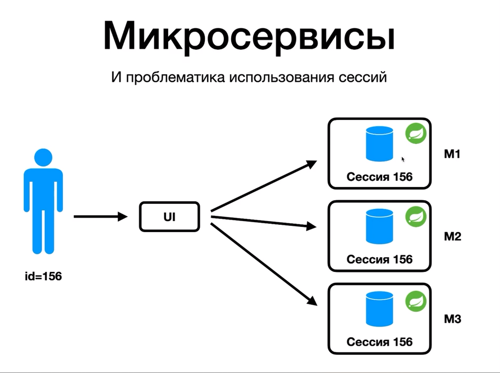
--------------------------------------
Данный подход не хорош, потому-что нам приходится дублировать данные.
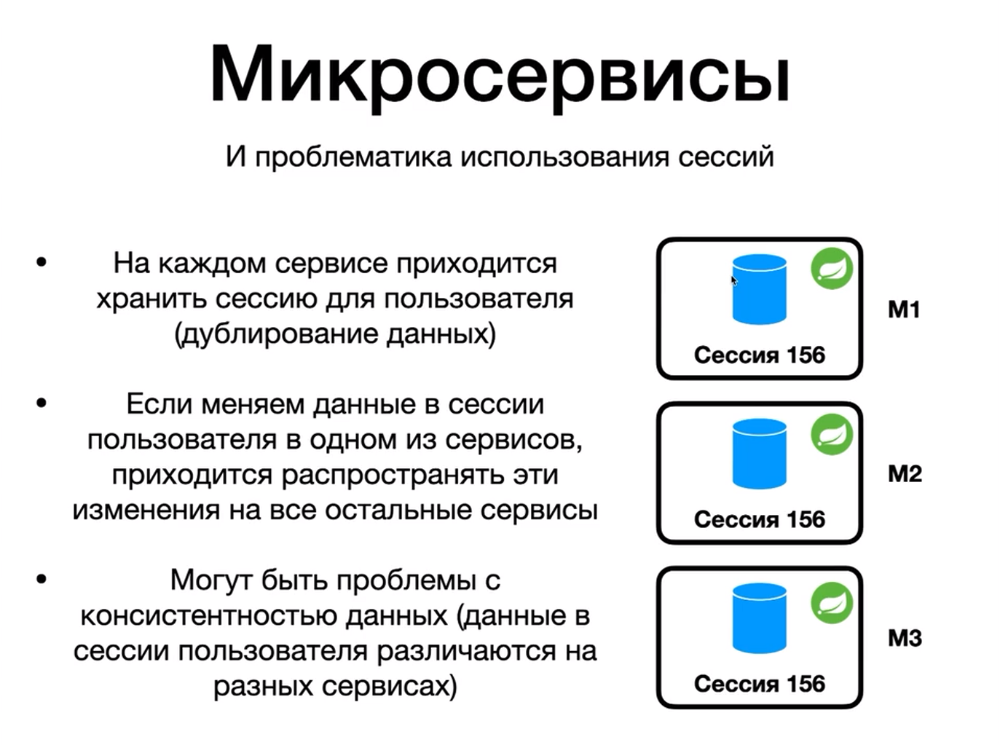
--------------------------------------
Мы можем остаться в парадигме Сессий и Cookie и при этом попытаться решить эту проблему. Таким образом у нас всё еще
остаётся Cookies у клиента, всё ещё остаётся 3 Микро-сервиса, но при этом мы можем сделать так что-бы у нас была одна
БД где у нас бы хранилось в одном экземпляре Сессия для пользователя. Это может быть отдельное БД или Отдельное Spring
приложение
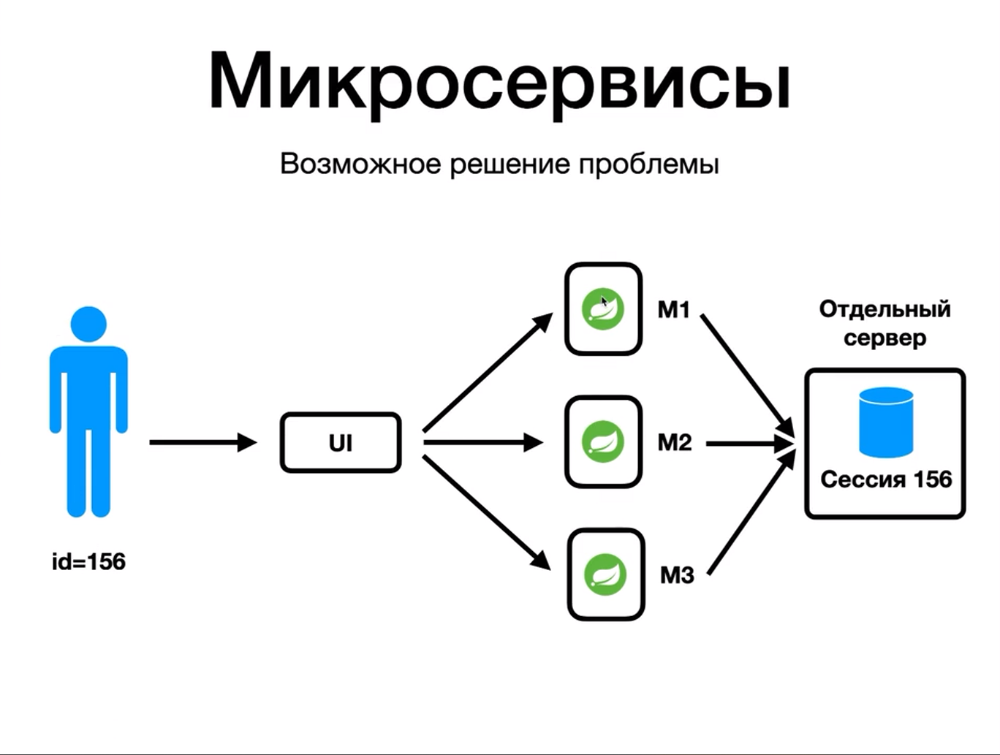
--------------------------------------
На самом деле здесь у нас есть еще 1 проблема.
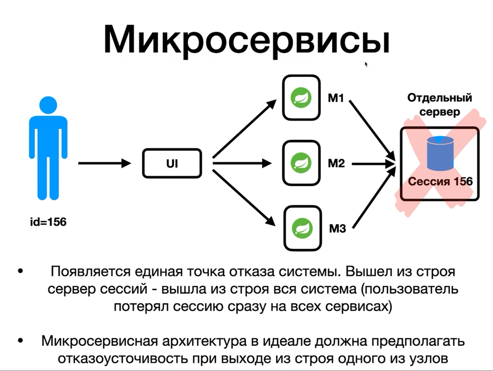
--------------------------------------
* Поэтому и появился JWT, это альтернативный способ аутентификации пользователя который чаще всего используется в
  Микро-сервисной архитектуре.
* В чем здесь разница, разница в том что здесь у нас сервера вообще не хранят никакие данные пользователя. То-есть JWT
  это механизм аутентификации Stateless без состояния. Ни на 1 из северов не хранятся данные пользователя.
* Все эти данные которые раньше хранились в Сессии (БД), все они теперь хранятся на самом клиенте. Пользователь где-то у
  себя на компьютере хранит этот JSON Web Token с данными своими и при каждом запросе на наши Сервера он передает этот
  JSON со своими данными на наши Сервера и этот JSON мы воспринимаем как его Сессию.
* Так получается что теперь нам не нужно думать о том, где хранить Сессию, потому-что клиент сам её нам присылает при
  каждом запросе.
  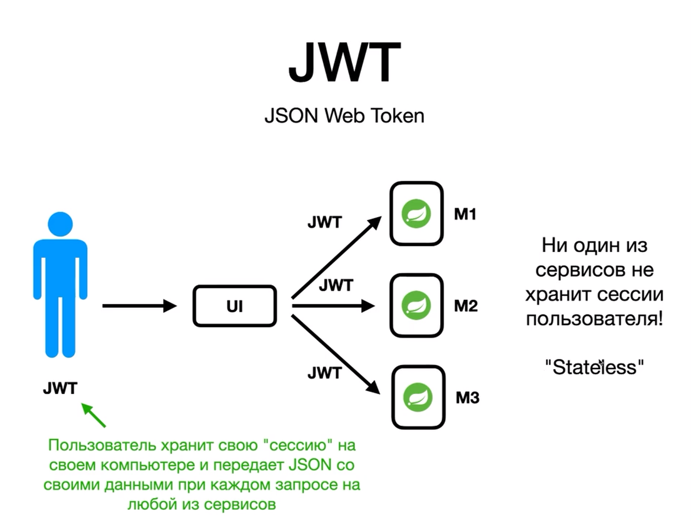

-------------------------------------- 
* Теперь разберем сам процесс аутентификации с помощью JWT

1. Client -> посылает свои логин и пароль на Server.
2. Server принимает логин и пароль, проверяет что такие логин и пароль есть в БД и если человек ввёл правильные логи и
   пароль то на Server'e мы создаём JWT Token для этого пользователя, и этот JWT Token зашифрованный с помощью
   секретного ключа который есть только на Server'e отправляется в виде JSON ответа обратно к Client'у, этот клиент
   получает JSON Token и сохраняет его у себя на компьютере.
3. После этого все остальные запросы от Client'a он посылает JWT_TOKEN в заголовке header, и при каждом запросе теперь
   мы посылаем JWT_Token от Клиента к Серверу. И в этом JWT_TOKEN'е содержатся все данные о клиенте, то-есть если
   Cookies это были просто ключ-значение. То в этом Token'е у нас могут содержаться любые данные о пользователе зашифрованные в этом Token'е.
4. Мы на Сервере принимаем этот Token смотрим что он валидный и действительно был создан нами, что клиент его не подделал и из этого токена мы можем получить все данные которые мы раньше клиенту назначили, получаем из токена допустим: name, email и допускаем пользователя.
   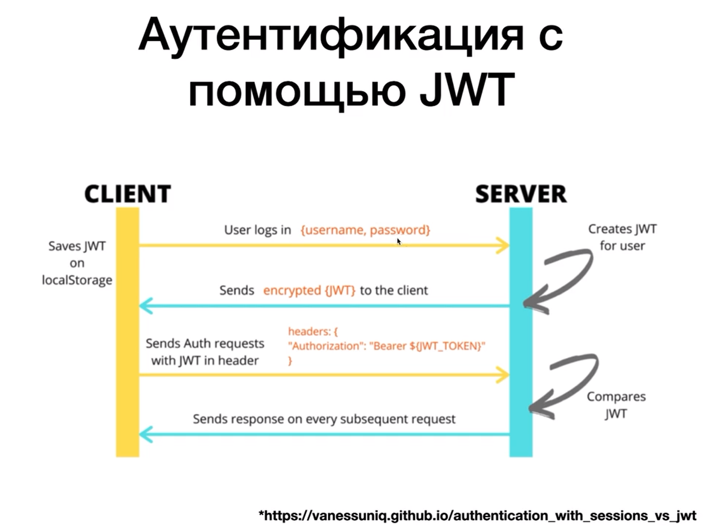
--------------------------------------
#### Структура токена.
* Здесь есть 2 точки, эти 2 точки разделяют логически этот токен на 3 части которые у нас помечена разными цветами.
1. Header
2. Payload
3. Signature
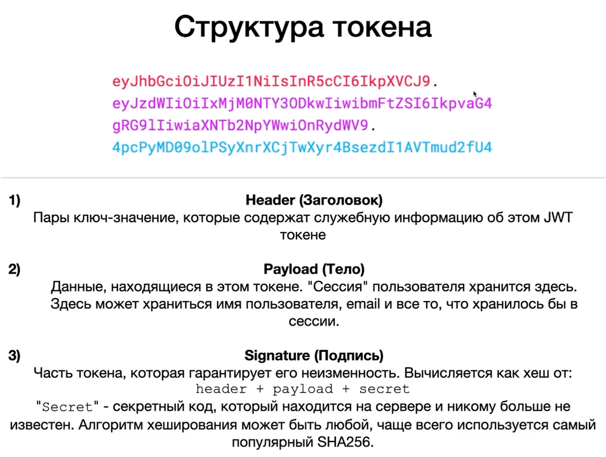
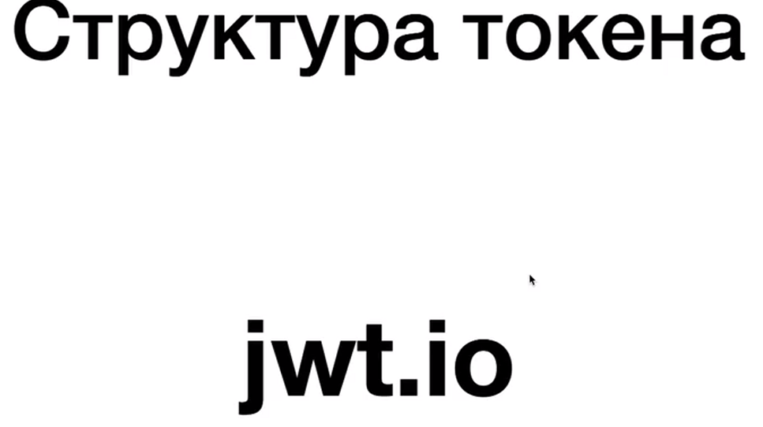
--------------------------------------
#### JWT vs Sessions + Cookies
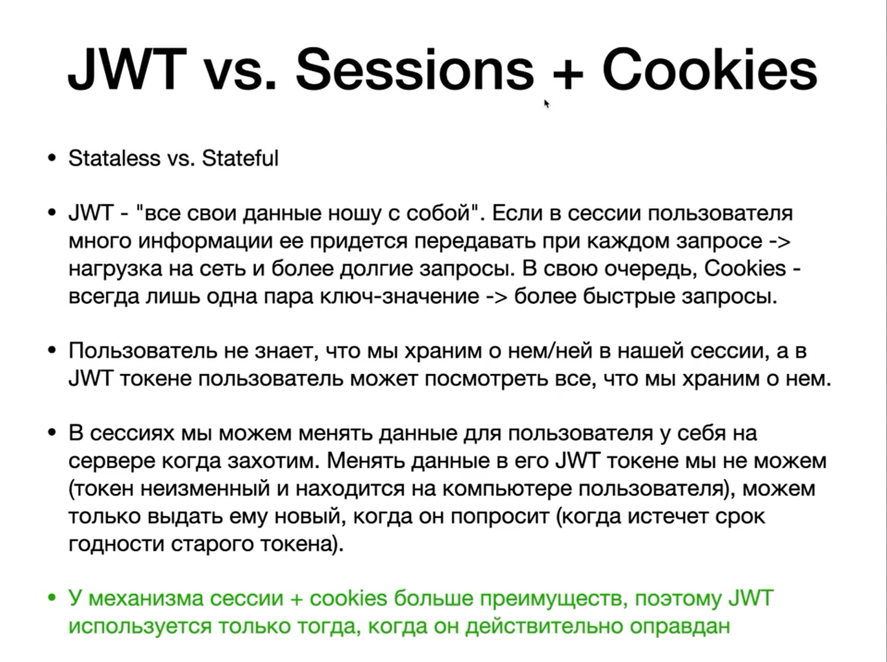
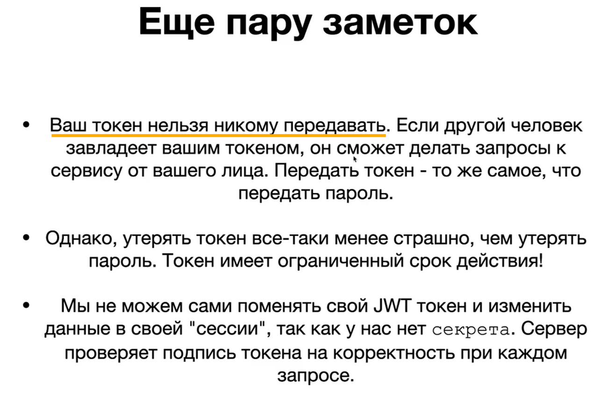